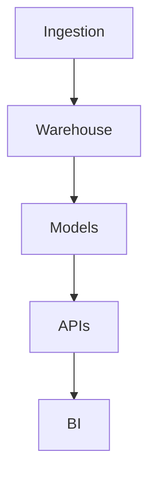

# Quarto Setup & Publishing – Strategia Tecnica (Markdown → DOCX/PDF/HTML/Quip)

This README gives you a minimal-but-complete setup to author your **tech strategy** in Markdown/Quarto and publish to **DOCX (for Quip)**, **PDF**, and **HTML**.

## 1) Prerequisiti (Arch Linux)

```bash
# strumenti base
sudo pacman -S --needed base-devel git

# Quarto (prebuilt AUR)
git clone https://aur.archlinux.org/quarto-cli-bin.git
cd quarto-cli-bin && makepkg -si && cd ..

# (Opzionalmente) motore PDF
sudo pacman -S tectonic    # oppure: sudo pacman -S texlive-most
```

> Se hai già Quarto, verifica:

```bash
quarto --version
quarto check
```

## 2) Struttura progetto

Crea una cartella e copia qui i tre file allegati:

```
strategia-retail/
├─ _quarto.yml        # configurazione build (HTML/DOCX/PDF, TOC, numerazione)
├─ index.qmd          # contenuto della strategia (Markdown/Quarto)
└─ README.md          # questo file
```

## 3) Configurazione YAML (riportata qui per riferimento)

Il file **\_quarto.yml** incluso è il seguente:

```yaml
project:
  type: book

book:
  title: "Strategia Tecnica – Piattaforma Retail"
  author: "Tuo Nome"
  chapters:
    - index.qmd

format:
  html:
    toc: true
    number-sections: true
  docx:
    toc: true
    number-sections: true
    # opzionale: usa un template DOCX di brand
    # reference-doc: templates/brand.docx
  pdf:
    toc: true
    number-sections: true
    pdf-engine: tectonic # o 'pdflatex' se usi TeX Live
```

> **Suggerimenti**
>
> - Puoi cambiare titolo/autore nel blocco `book:`.
> - Aggiungi capitoli ulteriori in `chapters:` (es. `capitolo-2.qmd`).

## 4) Scrivere i contenuti (index.qmd)

Nel file **index.qmd** puoi incollare il testo della tua strategia. Esempio di scheletro:

```markdown
---
title: "Strategia Tecnica – Piattaforma Retail"
subtitle: "Pricing, Scorte, Allocazione, Competitive Intelligence"
date: today
---

# 1) Problem statement

[contenuti]

# 2) Analisi dei dati forniti

[contenuti]

# 3) Approccio 30/60/90

[contenuti]

# 4) Architettura (cloud / on-prem / ibrida)

[contenuti]

# 5) Costi

[contenuti]

# Appendice A – Glossario (SKU, MAP, MOQ…)

[contenuti]
```

### Diagrammi

Per i diagrammi rapidi usa **Mermaid** (render top in HTML; per PDF potrebbe servire esportare come immagine se il TeX engine non rende). Esempio:

````markdown

````

````

Se devi importare in **Quip**, considera di salvare i diagrammi complessi come **PNG/SVG** e inserirli con:
```markdown

````

#### Mermaid diagrams (HTML / PDF / DOCX)

Quarto supports Mermaid out of the box.

##### How to write

Use a fenced block with the `{mermaid}` engine; you can add figure options (caption, format, width):

````{mermaid}
%%| fig-cap: "Architettura ibrida", format: svg, width: 800
graph TD
  A[On-prem] --> B[Warehouse]
  A --> D[Cloud Lake]
  D --> E[Training/Batch]
  E --> C[API On-prem]
  C --> F[BI & Alerting]


## 5) Build & Preview
```bash
# build per tutti i formati definiti (_quarto.yml)
quarto render

# build specifica
quarto render --to docx
quarto render --to pdf
quarto render --to html

# anteprima live HTML (server locale)
quarto preview
````

Gli artefatti vengono prodotti in `./_book/` (per i progetti book) o nella cartella corrente, a seconda del tipo di progetto. Apri il DOCX generato e **caricalo in Quip** per usare i commenti/revisioni.

fig-cap → didascalia (abilita cross-ref se aggiungi un label).

format: svg|png → formato incorporato in PDF/DOCX.

width: → larghezza figura.

## 6) Profili (facoltativo: diverse varianti del documento)

Puoi definire profili (es. _cloud_, _onprem_, _hybrid_) per cambiare alcune opzioni in build:

- Crea `_quarto-cloud.yml` con override, p.es.:

```yaml
format:
  html:
    theme: cosmo
```

- Esegui:

```bash
quarto render --profile cloud
```

## 7) Template DOCX di brand (opzionale)

Per un DOCX “aziendale”:

```
templates/brand.docx    # un doc vuoto con stili personalizzati
```

Riferiscilo in `_quarto.yml`:

```yaml
format:
  docx:
    reference-doc: templates/brand.docx
```

## 8) Consigli per l’import in Quip

- **DOCX** mantiene meglio titoli, elenchi e tabelle rispetto all’HTML copincollato.
- I **diagrammi mermaid** non sono supportati in Quip → usa immagini.
- Evita tabelle larghissime; preferisci 2–3 colonne chiave + note.
- Dopo la review in Quip, **riporta le modifiche** nel tuo `index.qmd` (fonte di verità).

## 9) Troubleshooting

- `quarto: command not found` → verifica `which quarto` e la presenza di `/usr/bin` in PATH; se AUR è corrotto, reinstalla `quarto-cli-bin`.
- PDF non compila → installa `tectonic` oppure `texlive-most`.
- Mermaid non in PDF → esporta i diagrammi in PNG/SVG e includili come immagini.

---

**Pronto all’uso:** inserisci i tuoi contenuti in `index.qmd` e lancia `quarto render --to docx` per ottenere il file da caricare in Quip.
